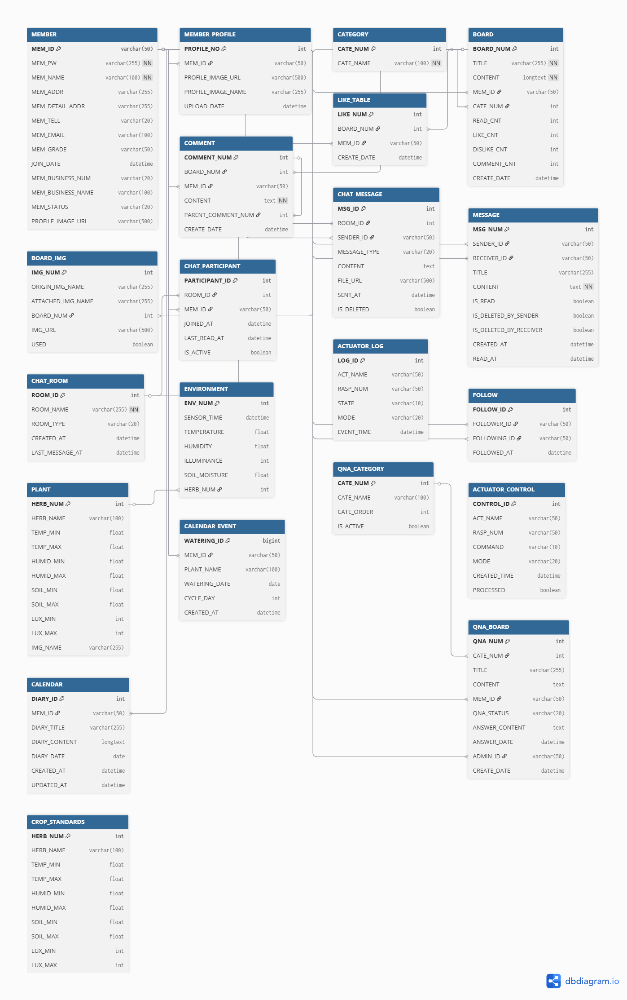

# 🌱 GitHerb - 식물 커뮤니티 플랫폼

> 3단계 프로젝트로 완성한 IoT 스마트팜 + 웹/모바일 커뮤니티 통합 플랫폼

---

## 🎯 프로젝트 개요 및 단계별 구성

| 단계 | 기간 | 주제 | 기술 스택 |
|------|------|------|---------|
| **1️⃣ IoT 개발** | 2025.09.11 ~ 09.24 | 스마트팜 IoT 기기 개발 및 자동제어 알고리즘 구축 | Python, Raspberry Pi, GPIO, MariaDB |
| **2️⃣ 웹 개발** | 2025.09.25 ~ 10.16 | React 기반 식물 커뮤니티 구축 (웹) | React, Spring Boot, MariaDB, Chart.js |
| **3️⃣ 앱 개발** | 2025.10.17 ~ 11.14 | React Native 기반 IoT 연동 및 실시간 채팅 | React Native, Expo, WebSocket, Spring Boot |

---

## 📊 데이터베이스 설계

---

## 🔗 단계별 프로젝트 요약

### 🔧 공통 백엔드 (Spring Boot)

**🎯 목표**
- RESTful API 설계 및 구현
- 실시간 채팅 WebSocket 시스템 구축
- 회원/게시판/채팅 등 통합 비즈니스 로직 관리

**💻 기술 스택**
### Backend
- **Framework**: Spring Boot 3.4.9
- **Language**: Java 17
- **ORM**: MyBatis 3.0.5
- **Database**: MariaDB
- **Real-time**: WebSocket (STOMP)

### Library & Tools
- **Lombok**: 보일러플레이트 코드 감소
- **JSoup**: HTML 파싱 및 이미지 추출
- **Log4jdbc**: SQL 쿼리 로깅
- **Date-holidays**: 한국 공휴일 처리

### API
- **Kakao API**: 날씨 정보 제공

**📊 주요 성과**
- ✅ 15+ RESTful API 엔드포인트 구현
- ✅ WebSocket STOMP로 안정적인 실시간 통신
- ✅ MyBatis를 통한 효율적 데이터 관리
- ✅ 이미지 자동 관리 스케줄러 (정크 파일 정리)
  
**[📄백엔드 - 프로젝트 링크](https://github.com/yoojisu90/dev-archive/tree/main/team/backend_plant_comunity)**

---

### 1️⃣ IoT 기기 개발

**🎯 목표**
- Raspberry Pi와 센서를 활용한 실시간 환경 모니터링 시스템 구축
- 식물 최적 환경 조건에 맞춘 자동 제어 알고리즘 개발
- 센서 데이터 정확성 95% 이상 달성

**💻 기술 스택**
- Python 3.9+, Raspberry Pi, DHT-22, LDR+ADC, MariaDB

**📊 주요 성과**
- ✅ 센서 데이터 수집 성공률 **95% 이상** 달성
- ✅ null 값 필터링으로 DB 오류 데이터 완전 제거
- ✅ 3회 재시도 로직으로 안정성 확보
- ✅ 바질(Basil) 최적 환경 조건 기반 자동 제어

**[📄IoT 센서 및 기기 제어 - 프로젝트 링크](https://github.com/yoojisu90/dev-archive/tree/main/IoT-python)**

---

### 2️⃣ React 웹 개발

**🎯 목표**
- IoT 센서 데이터를 시각화하는 웹 대시보드 구축
- 식물 커뮤니티 및 게시판 기능 개발
- 실시간 쪽지 시스템 구현

**💻 기술 스택**
### Frontend Core
- **React 18.2.0** - UI 라이브러리
- **React Router DOM 7.8.2** - 클라이언트 사이드 라우팅
- **Vite 7.1.2** - 빌드 도구 및 개발 서버
- **Axios 1.11.0** - HTTP 클라이언트

### UI & Visualization
- **Chart.js 4.5.0** & **React-Chartjs-2 5.3.0** - 센서 데이터 시각화
- **React Big Calendar 1.19.4** - 캘린더 컴포넌트
- **React Quill 2.0.0** - 리치 텍스트 에디터
- **Bootstrap Icons 1.13.1** - 아이콘 라이브러리

### Date & Time
- **Moment.js 2.30.1** - 날짜 포맷팅
- **date-fns 4.1.0** - 날짜 유틸리티
- **dayjs 1.11.18** - 경량 날짜 라이브러리
- **date-holidays 3.26.1** - 한국 공휴일 캘린더

### Additional Libraries
- **React Daum Postcode 3.2.0** - 한국 주소 검색
- **UUID 13.0.0** - 고유 ID 생성

### Backend Integration
- **Proxy Server**: Vite 개발 서버가 `/api` 요청을 `http://localhost:8080`로 프록시
- **Session Management**: sessionStorage를 사용한 로그인 정보 저장
- **Cookie Authentication**: Axios `withCredentials: true` 설정

### State Management
- React 내장 상태 관리 (useState, useEffect)
- sessionStorage (인증 정보)
- localStorage (사용자별 캘린더 데이터)
- Custom Events (쪽지 시스템 크로스 컴포넌트 통신)

**📊 주요 성과**
- ✅ 1초 주기 센서 데이터 실시간 갱신
- ✅ 아름다운 Chart.js 그래프 시각화
- ✅ 직관적인 캘린더 기반 일정 관리
- ✅ 이벤트 기반 크로스 컴포넌트 실시간 업데이트

**[📄웹 프론트엔드 - 프로젝트 링크](https://github.com/yoojisu90/dev-archive/tree/main/team/frontend_plant_comunity)**

---

### 3️⃣ React Native 앱 개발

**🎯 목표**
- 크로스 플랫폼 모바일 앱 개발 (iOS/Android)
- WebSocket 기반 실시간 채팅 시스템 구현
- IoT 데이터와 커뮤니티 기능의 완전한 통합

**💻 기술 스택**
- **React Native** (0.81.4) - 크로스 플랫폼 모바일 앱 개발
- **Expo** (~54.0.13) - React Native 개발 프레임워크
- **Expo Router** (~6.0.11) - 파일 기반 라우팅 시스템
- **WebSocket (@stomp/stompjs)** - 실시간 채팅 통신
- **SockJS Client** - WebSocket 폴백 지원
- **Axios** - HTTP 클라이언트
- **AsyncStorage** - 로컬 데이터 저장

**📊 주요 성과**
- ✅ WebSocket 싱글톤으로 안정적인 연결 관리
- ✅ FlatList 최적화로 효율적 리렌더링
- ✅ 다양한 메시지 타입 처리 (텍스트/이미지/파일)
- ✅ 크로스 플랫폼 호환성 (iOS/Android)

**[📄앱 프론트엔드 - 프로젝트 링크](https://github.com/yoojisu90/dev-archive/tree/main/team/app_plant_community)**

---

## 🎥 시연 영상

### 웹 (React)
<!--
<video width="100%" controls>
  <source src="videos/web_demo.mp4" type="video/mp4">
</video>
-->
*영상 준비 중...*

### 모바일 앱 (React Native)
<!--
<video width="100%" controls>
  <source src="videos/app_demo.mp4" type="video/mp4">
</video>
-->
*영상 준비 중...*

---

## 👥 프로젝트 정보

**프로젝트명**: GitHerb - 식물 커뮤니티 플랫폼
**개발 기간**: 2025.09.11 ~ 2025.11.14 (65일)
**개발 인원**: 4명 (풀 스택 개발)

---

## 📞 연락처

- **Email**: yoo901013@gmail.com
- **GitHub**: [@yoojisu90](https://github.com/yoojisu90)
- **Portfolio**: [GitHub Portfolio](https://github.com/yoojisu90/dev-archive)

---

**⭐ 3단계로 완성한 이 프로젝트가 마음에 드신다면 스타를 눌러주세요!**
